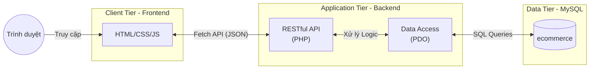
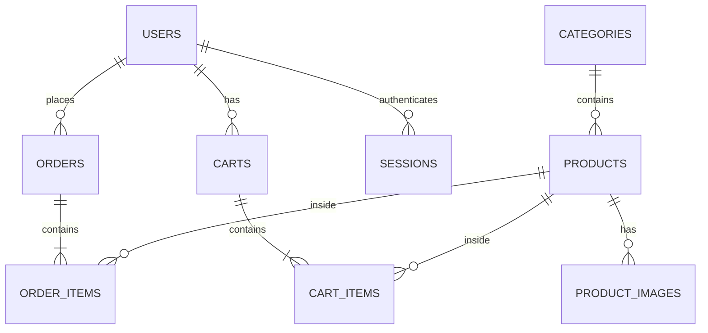

<div align="center">
  <h1>🛒 LTW Bán Hàng - Nền Tảng Thương Mại Điện Tử</h1>
  <p>Một hệ thống Website Bán Hàng cơ bản được xây dựng nguyên bản với Vanilla PHP, JavaScript và MySQL. Tối ưu, nhẹ nhàng và sẵn sàng sử dụng.</p>

  <p>
    
    
    
    
  </p>
</div>

---

## 📑 Mục lục
- [✨ Tính năng nổi bật (Features)](#-tính-năng-nổi-bật-features)
- [🛠️ Công nghệ sử dụng (Tech Stack)](#️-công-nghệ-sử-dụng-tech-stack)
- [🏗️ Kiến trúc hệ thống (Architecture)](#️-kiến-trúc-hệ-thống-architecture)
- [🗄️ Cơ sở dữ liệu (Database)](#️-cơ-sở-dữ-liệu-database)
- [📂 Cấu trúc thư mục (Project Structure)](#-cấu-trúc-thư-mục-project-structure)
- [🚀 Hướng dẫn cài đặt (Installation)](#-hướng-dẫn-cài-đặt-installation)
- [📡 API Documentation](#-api-documentation)

---

## ✨ Tính năng nổi bật (Features)

### 👤 Khách hàng (User)
- **Xác thực:** Đăng ký, Đăng nhập (với Session lưu trong Database), Đăng xuất.
- **Sản phẩm:** Lọc sản phẩm theo danh mục, Tìm kiếm.
- **Giỏ hàng:** Thêm, Sửa số lượng, Xóa sản phẩm khỏi giỏ.
- **Đặt hàng:** Xác nhận đơn hàng, Xem lịch sử đơn hàng.
- **Hủy đơn:** Người dùng có thể tự hủy đơn khi đơn ở trạng thái *Chờ xử lý*, tự động hoàn lại số lượng hàng (stock) về kho.

### 👑 Quản trị viên (Admin)
- **Dashboard:** Thống kê tổng quan, Báo cáo doanh thu theo biểu đồ, Top 5 sản phẩm bán chạy nhất.
- **Quản lý Sản phẩm:** Thêm, Sửa, Xóa sản phẩm. Quản lý ảnh (hỗ trợ nhiều ảnh cho một sản phẩm).
- **Quản lý Danh mục:** CRUD danh mục hàng hóa.
- **Quản lý Đơn hàng:** Xem chi tiết đơn hàng, Cập nhật trạng thái (Chờ xử lý ➔ Đã xác nhận ➔ Đang giao ➔ Đã giao ➔ Đã hủy). Hệ thống xử lý hoàn trả Stock thông minh khi đơn bị hủy.
- **Quản lý Người dùng:** Phân quyền, theo dõi người dùng hệ thống.

---

## 🛠️ Công nghệ sử dụng (Tech Stack)

| Layer | Công nghệ |
| :--- | :--- |
| **Frontend** | HTML5, CSS3 thuần (Không dùng Framework), Vanilla JavaScript |
| **Backend** | PHP 8.0+ (Thuần - Vanilla PHP), Tách biệt hoàn toàn API và Logic |
| **Database** | MySQL (Xử lý qua PDO - PHP Data Objects) |
| **API** | RESTful API, Fetch API (CORS enabled) |
| **Auth** | Token-based / Session lưu vào CSDL (bảng `sessions`) |

---

## 🏗️ Kiến trúc hệ thống (Architecture)

Dự án áp dụng mô hình **3-Tier Architecture** (Kiến trúc 3 Tầng) tách biệt hoàn toàn giữa Frontend (Giao diện) và Backend (Dữ liệu), giao tiếp 100% qua RESTful API.



---

## 🗄️ Cơ sở dữ liệu (Database)

Dự án có lược đồ CSDL được thiết kế chặt chẽ. Dưới đây là mô hình ER các bảng chính:



Các bảng chính:
- `users`: Quản lý người dùng (Phân quyền: `admin`, `customer`).
- `sessions`: Lưu trữ token đăng nhập.
- `products` & `categories`: Quản lý hàng hóa.
- `orders` & `order_items`: Lưu thông tin đặt hàng, trạng thái xử lý.

---

## 📂 Cấu trúc thư mục (Project Structure)

```text
LTW_BanHang/
├── backend/                  # Application Tier (API Server)
│   ├── api/                  # Chứa toàn bộ các endpoints (RESTful)
│   │   ├── admin/            # API dành riêng cho Quản trị viên
│   │   ├── auth/             # API Đăng nhập, Đăng ký, Check token
│   │   ├── cart/             # API Giỏ hàng
│   │   ├── orders/           # API Đặt hàng, Lịch sử
│   │   └── products/         # API Lấy danh sách sản phẩm hiển thị
│   ├── config/               
│   │   ├── config.php        # Cấu hình CSDL, CORS, hằng số
│   │   └── database.php      # Lớp kết nối PDO Singleton
│   └── uploads/              # Nơi chứa ảnh upload
├── frontend/                 # Client Tier (UI/UX)
│   ├── css/                  # Vanilla CSS
│   ├── js/                   # Javascript & Fetch API calls
│   ├── pages/                # Các trang HTML chi tiết
│   ├── admin/                # Giao diện cho Admin
│   ├── includes/             # Components tĩnh (Header, Footer)
│   └── index.html            # Trang chủ
├── database/                 
│   └── MYSQL/ecommerce/      # Scripts tạo CSDL và Seed data mẫu
├── run.bat                   # Script khởi chạy dự án nhanh chóng
└── README.md                 # Tài liệu hướng dẫn
```

---

## 🚀 Hướng dẫn cài đặt (Installation)

### 1. Yêu cầu môi trường
- PHP 8.0 trở lên.
- MySQL Server (Có thể dùng XAMPP / MAMP / WAMP).
- Trình duyệt Web hiện đại.

### 2. Cài đặt Cơ sở dữ liệu
1. Mở phpMyAdmin (hoặc bất kỳ MySQL Client nào).
2. Tạo database mới với tên `ecommerce` (Charset: `utf8mb4_unicode_ci`).
3. Import file SQL: `database/MYSQL/ecommerce/0_ecommerce.sql` để tạo các bảng.
4. (Tùy chọn) Import tiếp các file từ `1_seed_products.sql` đến `4_seed_recent_orders.sql` để có dữ liệu mẫu test hệ thống.

### 3. Cấu hình Backend
Đảm bảo thông tin kết nối CSDL trong file `backend/config/config.php` là chính xác:
```php
define('MYSQL_HOST', 'localhost');
define('MYSQL_PORT', '3306');
define('MYSQL_DATABASE', 'ecommerce');
define('MYSQL_USERNAME', 'root');
define('MYSQL_PASSWORD', '');
```

### 4. Khởi chạy dự án
Chỉ cần nhấp đúp vào file `run.bat` ở thư mục gốc. Script sẽ tự động:
1. Mở một server PHP cho **Backend** tại: `http://localhost:8080`
2. Mở một server PHP cho **Frontend** tại: `http://127.0.0.1:5500`

> 💡 *Lưu ý:* Nếu sử dụng XAMPP, bạn cũng có thể copy cả thư mục vào `htdocs` và truy cập trực tiếp bằng Apache.

---

## 📡 API Documentation

Dự án áp dụng chuẩn RESTful. Response luôn trả về định dạng `JSON` cấu trúc chung:
```json
{
  "success": true,
  "message": "Thành công!",
  "data": { ... }
}
```

Một số endpoints tiêu biểu:

| Method | Endpoint | Quyền truy cập | Chức năng |
| :--- | :--- | :--- | :--- |
| `POST` | `/api/auth/login.php` | Public | Xác thực & trả về Session Token |
| `GET` | `/api/products/get_home.php` | Public | Lấy Top SP Bán Chạy & SP Mới Nhất |
| `GET` | `/api/cart/get.php` | Customer | Lấy giỏ hàng của user hiện tại |
| `POST` | `/api/orders/create.php` | Customer | Đặt hàng |
| `GET` | `/api/admin/dashboard.php` | Admin | Lấy thống kê tổng quan hệ thống |
| `POST` | `/api/admin/orders/update_status.php` | Admin | Đổi trạng thái đơn hàng |

---

<div align="center">
  <i>Được phát triển và hoàn thiện để phục vụ đồ án thiết kế Web Bán Hàng 🚀</i>
</div>
